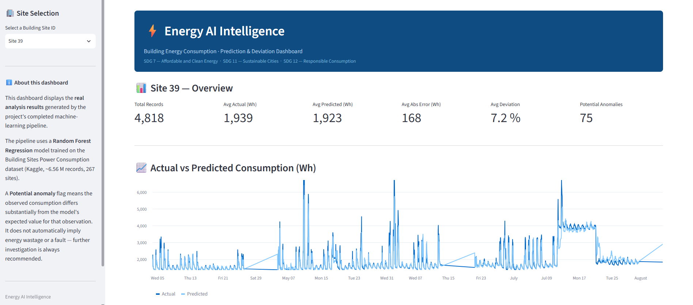
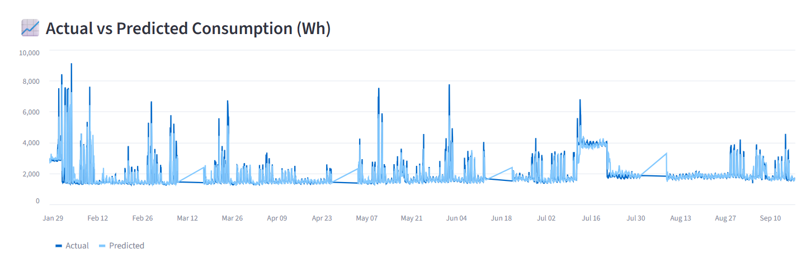
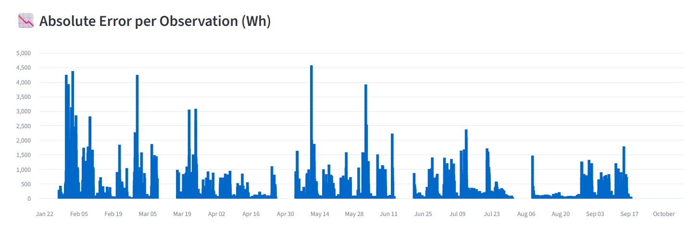
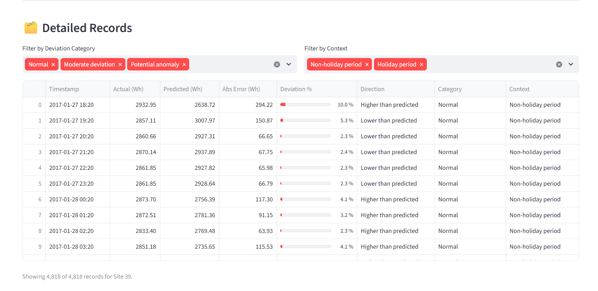
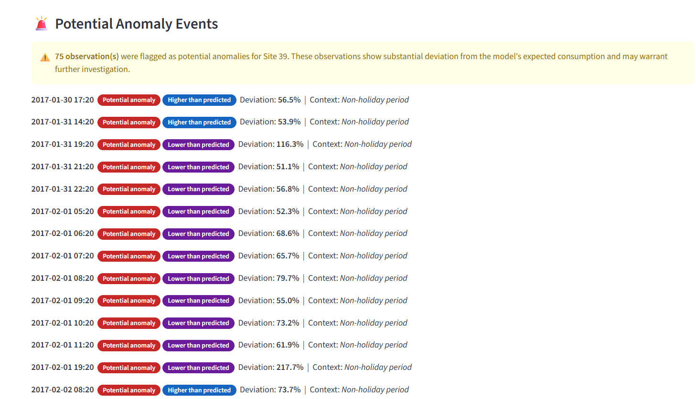
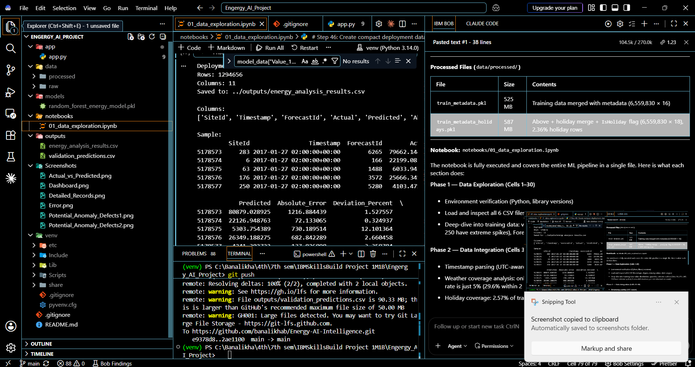
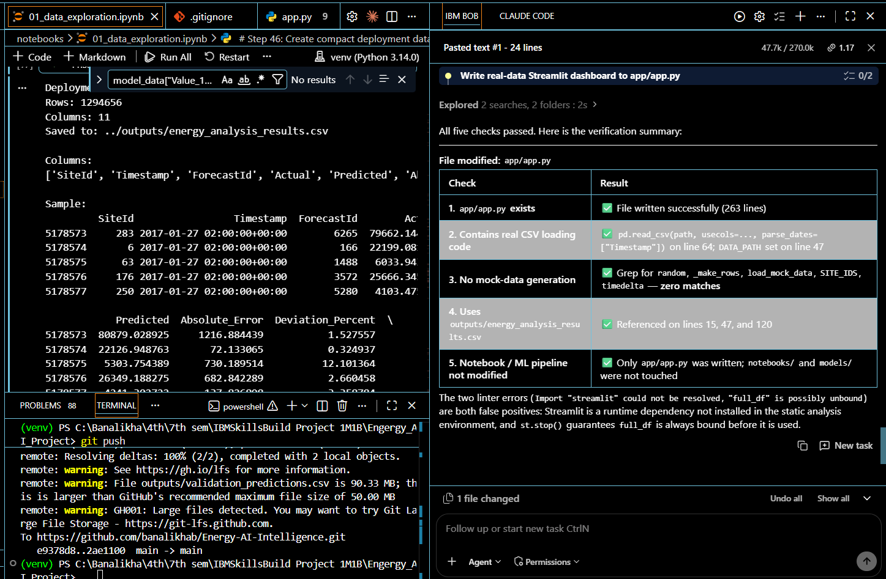

# Energy AI Intelligence

An AI-driven energy intelligence project developed as part of the **1M1B AI for Sustainability Virtual Internship** in collaboration with IBM SkillsBuild and AICTE.

The project focuses on **building energy consumption** and uses data analysis, machine learning, prediction, deviation analysis, anomaly detection, and IBM Bob to create an AI-assisted system for understanding energy consumption patterns.

---

## Problem Statement

Buildings consume significant amounts of energy, but unusual consumption patterns can be difficult to identify from large-scale time-series data.

This project aims to analyze building energy consumption, estimate expected consumption, identify significant deviations, and present the results in a more understandable form through an AI-assisted interface.

The goal is to help users identify potentially unusual energy consumption patterns and understand the analytical results without having to manually inspect large amounts of raw energy data.

---

## Sustainable Development Goal

### SDG 7 — Affordable and Clean Energy

The project is aligned primarily with **UN Sustainable Development Goal 7: Affordable and Clean Energy**.

By analyzing building energy consumption and identifying potentially abnormal usage patterns, the project aims to support more informed and efficient energy management.

---

## Project Workflow

The overall workflow of the project is:

```text
                 Building Energy Dataset
                          │
                          ▼
                 Data Cleaning & Processing
                          │
                          ▼
                Dataset Integration
                          │
                          ▼
              Exploratory Data Analysis
                          │
                          ▼
              Energy Consumption Analysis
                          │
                          ▼
                ML Prediction / Analysis
                          │
                          ▼
                Deviation Calculation
                          │
                          ▼
                 Anomaly Identification
                          │
                          ▼
                    IBM Bob Agent
                          │
                          ▼
              User Question / Interaction
                          │
                          ▼
             AI-assisted Energy Explanation
```

The prototype is designed so that the user does not need to manually inspect millions of energy-consumption records.

---

## Dataset

The project uses the **Building Sites Power Consumption Dataset** available through Kaggle.

The dataset contains information from multiple building sites and includes:

- Training data
- Test data
- Site metadata
- Holiday information
- Weather data
- Forecast information

The project investigates relationships between:

- Site
- Timestamp
- Energy consumption
- Building characteristics
- Holidays
- Weather availability
- Expected versus observed consumption

### Dataset Scale

The training dataset contains approximately **6.56 million observations** across **267 sites**.

The project also examined the availability and coverage of weather information instead of assuming that weather data was available for every energy-consumption observation.

> Raw datasets are not included in this repository because of their large file sizes. The original dataset should be obtained separately from its source.

---

## Data Processing

The project includes several data-processing stages:

1. Loading the individual dataset files.
2. Inspecting the structure and data types.
3. Checking missing values and duplicate records.
4. Integrating site metadata with energy-consumption data.
5. Processing holiday information.
6. Investigating weather-data availability.
7. Converting and validating timestamp information.
8. Examining site-level and time-based consumption patterns.
9. Preparing data for prediction and anomaly analysis.

---

## AI / Machine Learning Components

The project uses:

- **Python**
- **Pandas**
- **NumPy**
- **Scikit-learn**
- **Machine Learning**
- **Energy consumption analysis**
- **Prediction**
- **Deviation analysis**
- **Anomaly detection**
- **IBM Bob**
- **VS Code**
- **GitHub**

IBM Bob is used as the AI-assisted interaction layer for the prototype.

The ML/data-analysis pipeline remains responsible for working with the actual energy-consumption data and generating analytical results.

---

## Energy Analysis

The system focuses on comparing observed energy consumption with expected or predicted consumption.

A simplified representation of the analysis is:

```text
Actual Consumption
        │
        │
        ▼
Compare with
Expected / Predicted Consumption
        │
        ▼
Calculate Deviation
        │
        ▼
Check for Significant Difference
        │
        ▼
Anomaly Flag
```

The resulting information can be used to identify observations that require further investigation.

---

## Prototype

The prototype uses **IBM Bob** as the AI interaction layer.

The intended interaction is:

```text
User
  │
  │  "Analyze Site 42."
  ▼
IBM Bob
  │
  ▼
Energy Analysis
  │
  ├── Site information
  ├── Actual consumption
  ├── Expected / predicted consumption
  ├── Deviation
  └── Anomaly status
  │
  ▼
AI-assisted explanation
  │
  ▼
User
```

### Example User Queries

The prototype is designed around questions such as:

```text
Analyze Site 42.
```

```text
Was the energy consumption abnormal?
```

```text
What was the actual versus predicted consumption?
```

```text
Explain why this observation was flagged.
```

The final response should be based on the project's actual analysis results rather than fabricated values.

---

## Role of IBM Bob

IBM Bob is used to provide the AI-assisted interaction layer of the project.

Instead of requiring a user to directly inspect Python outputs or large datasets, the prototype aims to allow the user to ask questions in natural language and receive an understandable interpretation of the available energy-analysis results.

The project does **not** depend on IBM Granite.

---

## Technologies Used

| Technology   | Purpose                                |
| ------------ | -------------------------------------- |
| Python       | Core programming and analysis          |
| Pandas       | Data processing                        |
| NumPy        | Numerical operations                   |
| Scikit-learn | Machine learning                       |
| IBM Bob      | AI-assisted interaction                |
| VS Code      | Development environment                |
| GitHub       | Version control and project repository |

---

## Repository Structure

The repository is organized around the project's analysis and prototype components.

```text
Energy-AI-Intelligence/
│
├── README.md
│
├── src/
│   ├── Python analysis files
│   ├── preprocessing files
│   └── prediction / anomaly analysis files
│
├── results/
│   └── Analysis and prediction outputs
│
├── screenshots/
│   └── Prototype screenshots
│
├── requirements.txt
│
└── .gitignore
```

The exact structure may change as the prototype is finalized.

---

## Prototype Evidence

Screenshots demonstrating the project will be added as the prototype is finalized.

Recommended evidence includes:

### 1. Project / GitHub

Screenshot showing the GitHub repository and project structure.

### 2. Data Analysis

Screenshot showing the project's actual energy-analysis or prediction output.

### 3. IBM Bob

Screenshot showing the IBM Bob project/agent configuration.

### 4. User Interaction

Screenshot showing a user query such as:

```text
Analyze Site 42.
```

### 5. AI Result

Screenshot showing the resulting energy-analysis response, including relevant prediction, deviation, and anomaly information.

---

## Current Project Status

The major data-analysis and machine-learning stages of the project have been completed.

The current development stage focuses on:

- Finalizing the IBM Bob interaction.
- Connecting the AI interaction to the project's actual analytical results.
- Demonstrating the prediction and anomaly-analysis workflow.
- Preparing a clean end-to-end prototype.
- Capturing screenshots of the working prototype.
- Documenting the final implementation.

---

## Limitations

- The project uses a historical public dataset rather than live building sensor data.
- Weather information is not available for every energy-consumption observation.
- The prototype is an AI-assisted analytical demonstration and is not a production building-energy-management system.
- Anomaly detection identifies unusual observations but does not automatically establish the physical cause of the anomaly.
- Predictions and anomaly flags should therefore be treated as analytical indicators requiring further investigation.

---

## Future Scope

Possible future improvements include:

- Integration with live smart-meter or IoT data.
- Real-time energy monitoring.
- Real-time anomaly alerts.
- More advanced time-series forecasting.
- Energy-saving recommendations.
- Building-level dashboards.
- Integration of additional weather and environmental variables.
- Deployment as a web-based energy intelligence platform.

---

## Dashboard Screenshots

Screenshots of the locally running Streamlit dashboard can be added here to demonstrate the project interface and results.

## Dashboard Screenshots

The following screenshots demonstrate the main features of the Streamlit dashboard, including energy forecasting, prediction error analysis, detailed records, and potential anomaly identification.

### 1. Dashboard Overview



### 2. Actual vs Predicted Energy Consumption



### 3. Prediction Error Analysis



### 4. Detailed Energy Records



### 5. Potential Anomaly Detection



### 6. Additional Anomaly Analysis


## IBM Bob Integration

IBM Bob was used as an AI-assisted tool during the development of the Energy AI Intelligence project. It was used to understand the project context, analyze the existing implementation, and assist with modifications to the project.

### Bob Project Overview

The initial Bob workspace and project environment are shown below.



### Bob Analysis and Modifications

Bob analyzed the project information and provided assistance with modifications to the implementation.



## Running the Streamlit Dashboard Locally

The project includes an interactive Streamlit dashboard that allows users to explore energy consumption, compare actual and predicted values, analyze deviations, and identify potential anomaly events.

### 1. Clone the Repository

Open a terminal or Command Prompt and run:

```bash
git clone https://github.com/banalikhab/Energy-AI-Intelligence.git
cd Energy-AI-Intelligence
```

### 2. Create a Virtual Environment

Creating a virtual environment is recommended to keep the project's Python packages separate from other projects.

```bash
python -m venv venv
```

### 3. Activate the Virtual Environment

For Windows:

```bash
venv\Scripts\activate
```

For macOS/Linux:

```bash
source venv/bin/activate
```

After activation, the terminal should show `(venv)` before the current directory.

### 4. Install Streamlit and Required Libraries

Install the required Python packages using:

```bash
pip install streamlit pandas numpy matplotlib scikit-learn openpyxl joblib
```

If the project contains a `requirements.txt` file, the dependencies can instead be installed using:

```bash
pip install -r requirements.txt
```

### 5. Verify Streamlit Installation

Check whether Streamlit has been installed correctly:

```bash
streamlit --version
```

The installed Streamlit version should be displayed in the terminal.

### 6. Run the Streamlit Dashboard

From the project root directory, run:

```bash
streamlit run app/app.py
```

After starting the application, Streamlit will provide a local URL in the terminal, usually:

```text
http://localhost:8501
```

Open this URL in a web browser to view the dashboard.

### 7. Explore the Dashboard

The dashboard provides the following features:

- Select a Site ID from the sidebar.
- View energy consumption KPIs.
- Compare Actual and Predicted energy consumption.
- Analyze Absolute Error.
- View Deviation Percentage and Deviation Direction.
- Identify potential anomaly events.
- Inspect detailed energy-consumption records.
- View contextual information related to the observations.
- Review the generated interpretation of the energy-consumption results.

### 8. Stop the Dashboard

To stop the Streamlit application, return to the terminal where it is running and press:

```text
Ctrl + C
```

### Important Note

The Streamlit dashboard displays the analysis results generated by the project's machine-learning pipeline. Opening the dashboard does not retrain the Random Forest model.

The large datasets, trained model files, and generated CSV files are kept locally and are excluded from the GitHub repository because of their large file sizes.

The dashboard is intended for local demonstration and analysis of the project's energy forecasting and anomaly-detection results.

---

## Project Information

**Project:** Energy AI Intelligence

**Program:** 1M1B AI for Sustainability Virtual Internship 2026

**Primary SDG:** SDG 7 — Affordable and Clean Energy

**AI Technology:** IBM Bob

**Development:** Python, Machine Learning, VS Code

**Repository:** Energy-AI-Intelligence

**Author:** Banalikha Bhattacharjya
